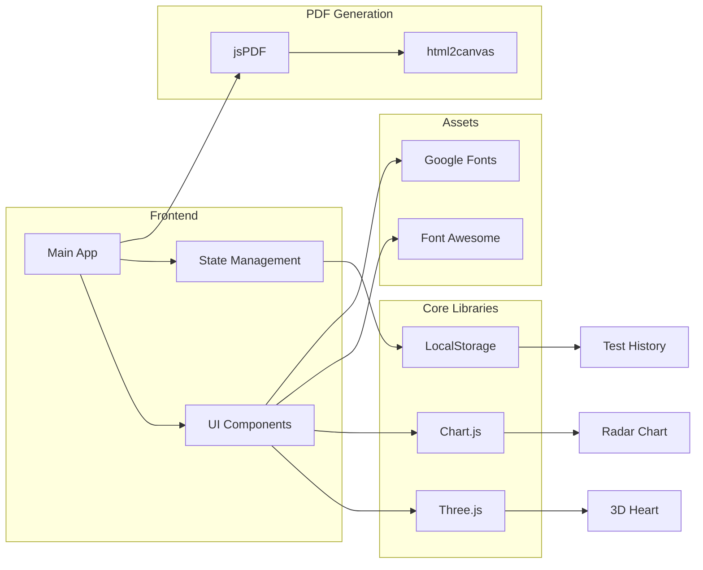

# Big Five Personality Test Website 大五性格測驗網站
## English
A modern, interactive Big Five Personality Test website designed to help users discover their personality traits through a scientifically validated psychological model. The test measures the five key dimensions of personality: Openness, Conscientiousness, Extraversion, Agreeableness and Neuroticism (OCEAN). It also shows the introversion/extraversion percentage.

### Core Features
#### 1. Comprehensive Personality Assessment
- **OCEAN Model Implementation**:
  - 5-point Likert scale responses (1-5)
  - Reverse-scored items to prevent response bias
  - Normalised scoring (0-5 scale with percentage conversion)

#### 2. Multi-language System
- **Complete Localisation**:
  - Cantonese (Hong Kong) with colloquial expressions
  - Mandarin Chinese (Traditional) version
  - Englis (UK) localisation
  - Language-specific result interpretations
- **Dynamic Language Switching**:
  - Preserves answers when switching languages
  - Automatic UI text updates
  - Language-specific formatting

#### 3. Interactive Visualisations
- **3D Elements**:
  - Interactive heart model with OrbitControls
    - Metallic material with realistic lighting
    - Auto-rotation with manual override
    - Mobile touch support
  - Floating particle animations
  - Confetti celebration effects
- **Data Visualisation**:
  - Radar chart with dynamic theming
  - Responsive design adapts to screen sise
  - Accessibility-friendly colour schemes

#### 4. User Experience Features
- **Progress Tracking**:
  - Animated progress bar with shine effect
  - Percentage completion indicator
  - Hover-to-view details
- **Question Navigation**:
  - Paginated display (10 questions/page)
  - Smooth scroll transitions
  - Previous/Next buttons with icons
- **Result Presentation**:
  - Flip-card design for trait explanations
  - Front: Summary statement
  - Back: Detailed description
  - Visual hint for interactive elements

#### 5. Data Management
- **Test History**:
  - Stores last 10 test results
  - Includes timestamp and all scores
  - Clear history functionality
- **PDF Export**:
  - Customisable with username
  - Includes radar chart image
  - Professional formatting with footer
  - Dark/light mode adaptation

#### 6. Theme System
- **Dark/Light Mode**:
  - Toggle button in header
  - Automatic chart theming
  - CSS variable-based implementation
  - Persists across pages
- **Dynamic Styling**:
  - Answer options change colour based on selection
  - Button hover effects
  - Responsive typography

### Frontend Architecture
- **Modular JavaScript**:
  - app.js: Main application logic
  - questions.js: Question data
  - Event-driven design
- **Performance Optimisations**:
  - Lazy loading of heavy libraries
  - RequestAnimationFrame for animations
  - Efficient DOM updates

#### Dependencies

#### Browser Compatibility & RWD
- Succuessfully tested on:
  - Chrome, Egde, Firefox, Safari
- Mobile responsive:
  - Adapting to screen size with touch-friendly controls and readable typography

### Contribution
Welcome contributions in:
- Additional language translations
- Improved question sets
- Enhanced visualisation options
- Accessibility improvements
Please submit issues, pull requests through GitHub or contact the developer by [email](mailto:nokhei@tuta.io).

### License
CC BY-SA 4.0 - Must credit [@nokhei](https://github.com/nokhei)/[@nok6hei1](https://instagram.com/nok6hei1) when sharing or modifying this project.

---

## 廣州話/粵語（香港）Cantonese (Hong Kong)
現代化、互動性嘅 Big5（大五）性格測驗網站，基於科學驗證嘅心理模型，幫助使用者了解自己嘅性格特徵。測驗會評估五個主要性格維度：經驗開放度、認真盡責度、外向度、親和度同情緒不穩定度（OCEAN），結果仲會有埋內向/外向Percentage。

### 核心功能
#### 1. 全面性格評估
- **OCEAN模型實現**：
  - 五分李克特量表（1-5 分）
  - 包含反向計分項目防止偏差
  - 標準化評分（0-5 分制轉換百分比）

#### 2. 多語言系統
- **完整本地化**：
  - 地道香港粵語版本
  - 正體中文版本
  - 英式英語版本
  - 語言專屬結果解釋
- **動態語言切換**：
  - 切換語言保留答案
  - 自動更新界面文字
  - 語言專屬格式設定

#### 3. 互動可視化
- **3D元素**：
  - 可互動心形模型：
    - 金屬材質、真實光影
    - 自動旋轉、手動控制
    - 支援電話觸控
  - 浮動粒子動畫
  - 彩色碎紙慶祝效果
- **數據可視化**：
  - 支援主題切換嘅雷達圖
  - 適應屏幕大小
  - 無障礙顏色方案

#### 4. 使用者體驗功能
- **進度追蹤**：
  - 閃光動畫進度條
  - 完成百分比顯示
  - 懸停查看詳情
- **問題導航**：
  - 分頁顯示（每頁 10 題）
  - 平滑滾動過渡
  - 帶有圖標嘅上一頁/下一頁按鈕
- **結果展示**：
  - 翻轉卡片設計
  - 正面：特質摘要
  - 背面：詳細描述
  - 互動元素視覺提示

#### 5. 數據管理
- **測驗紀錄**：
  - 儲存最近 10 次結果
  - 包含時間戳同所有分數
  - 清除紀錄功能
- **PDF匯出**：
  - 可以輸入使用者名稱
  - 包括雷達圖圖片
  - 專業格式設定，帶有 footer
  - 適應光暗模式

#### 6. 主題系統
- **光/暗模式**：
  - 頁首切換按鈕
  - 圖表自動適應主題
  - 基於 CSS 變數實現
  - 跨頁面持久化
- **動態樣式**：
  - 選項根據選擇變色
  - 按鈕懸停效果
  - 響應式設計排版

### 前端架構
- **模組化JavaScript**：
  - app.js：主要應用邏輯
  - questions.js：問題數據
  - 事件驅動設計
- **性能改善**：
  - 延遲加載 Libraries
  - 使用 RequestAnimationFrame 處理動畫
  - 高效率 DOM 更新

#### 依賴關係

#### 瀏覽器兼容性、RWD
- 成功測試咗喺：
  - Chrome、Edge、Firefox、Safari

- 響應式設計：
  - 適應屏幕尺寸、觸控友善控制、易讀排版

### 貢獻
歡迎貢獻：
- 繙譯做更加多語言
- 改善測驗問題
- 加強可視化選項
- 無障礙改善
歡迎透過 GitHub 提交 issue、pull request 或者 [send email](mailto:nokhei@tuta.io) 貢獻。

### 授權
CC BY-SA 4.0 - 分享或者修改呢個 project 嗰陣煩請 tag 返 [@nokhei](https://github.com/nokhei)/[@nok6hei1](https://instagram.com/nok6hei1)。